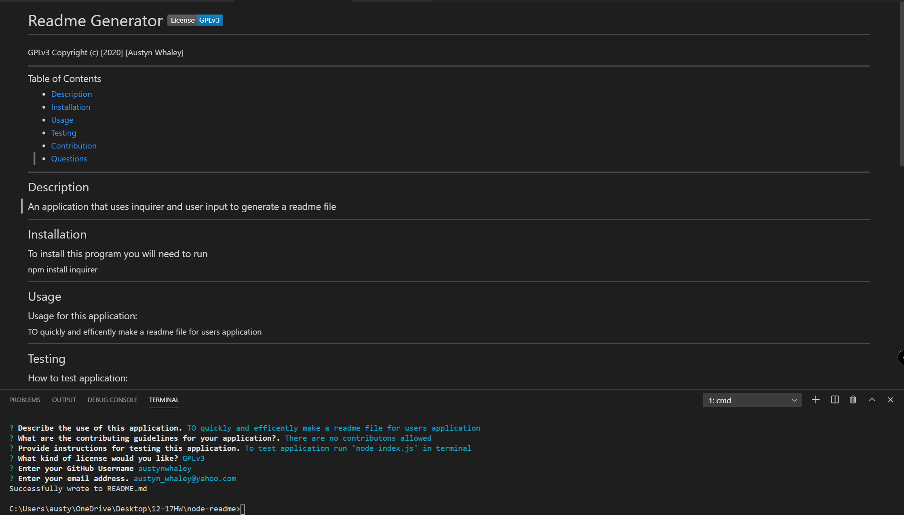

# Node Readme Generator

## License

Copyright (c) [2020] [Austyn Whaley]

---

### Table of Contents
- [Link to Video](https://drive.google.com/file/d/1lHDvzhaMNLRQKeV-6jWffOngx7F5sYqZ/view)
- [Description](#description)
- [Installation](#installation)
- [Usage](#usage)
- [Testing](#Testing)
- [Questions](#Questions)

---

## Description

This is an application that uses the Inquirer package and takes user input, then generates a MD file for the user and their application.

---

## Installation

To use this application be sure to input ion terminal 'npm install inquirer' in the terminal.

---

## Usage

This application would be used to quickly and efficently make a readme file for user and save time when develpoing their application

---

## Testing

#### To test the application just run 'node index.js' in your terminal. 
#### Also visit the link in the table of contents to see it in use.

---

## Questions

Any questions regarding the application can be answered at:

[Link to Github](https://github.com/austynwhaley/)
##### Email: austyn_whaley@yahoo.com